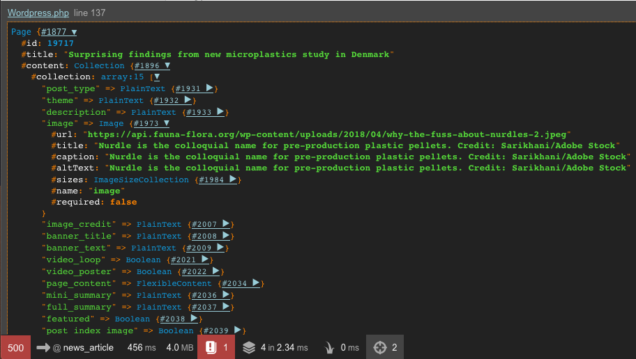

# Debugging

* TOC
{:toc}



## Symfony debugger

On your local development environment you will see the Symfony debug bar which displays:


* HTTP status code
* Matching route
* Page generation time and memory usage
* Twig template generation time

### Inspecting template variables

The controller defines the variables to pass onto the view. Example controller code:

```PHP
return $this->render('news/article.html.twig', [
    'url' => sprintf('/news/%s', $slug),
    'page' => $page
]);
```

You can then inspect the variable via the `dump()` command.

When used in your template, this will output the variable directly to the page. E.g.

```
{{ dump(page) }}
```


The above example shows the `page` object which represents, in this instance, a news post from WordPress.

The inspector shows the object types for each content field, you can find out more about these at [Content Fields](content-fields.md).

### Inspecting variables in PHP

You can also use the `dump()` function in PHP, this will output the variable to the Symfony debugger inspector. E.g.

```
dump($page);
```  

Select the inspector icon  to inspect the variable.



The example above also shows the debug bar with an error, additional information such as the error details can be accessed 
from here.

